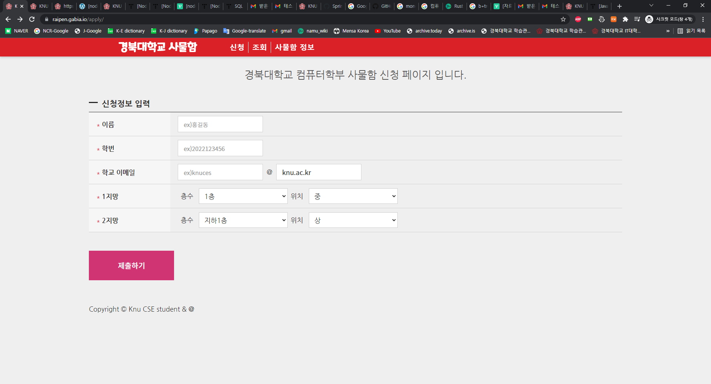

# KNU CSE 사물함 신청 [\[바로가기\]](https://locker.raipen.com)

> 경북대학교 컴퓨터학부 사물함 신청 서비스

[](https://youtu.be/X62gA5kJoic)

## 개발 환경 세팅

0. git과 node 설치

1. 레파지토리 다운로드 및 라이브러리 설치

   ```shell
   git clone https://github.com/raipen/knu_locker.git
   cd knu_locker
   npm install
   ```

2. 환경변수 설정
   - .env 파일 생성
   - .env 파일 내용(예시: ```.local.docker.env```)
   ```env
   testDBaddress={테스트용 데이터베이스 주소}
   testDBuser={테스트용 데이터베이스 유저}
   testDBpassword={테스트용 데이터베이스 비밀번호}
   testDBdatabase={테스트용 데이터베이스 이름}
   DBaddress={배포용 데이터베이스 주소}
   DBuser={배포용 데이터베이스 유저}
   DBpassword={배포용 데이터베이스 비밀번호}
   DBdatabase={배포용 데이터베이스 이름}
   DBport={데이터베이스 포트}
   PORT={서비스 포트}
   VITE_START_DATE={신청 시작일}
   DEAD_LINE={신청 마감일}
   VITE_DEAD_LINE={신청 마감일}
   SEMESTER={학기}
   LAST_SEMESTER={직전 학기}
   VITE_EXECUTE_KAKAO_ID={집행부장 카카오톡 아이디}
   VITE_FINANCE_KAKAO_ID={재정부장 카카오톡 아이디}
   KAKAO_CLIENT_ID={카카오 로그인 js 키}
   KAKAO_REDIRECT_URI={카카오 로그인 리다이렉트 URI}
   ```

3. (필요시) 데이터베이스 설정

4. 개발 서버 실행

   ```shell
   npm run dev
   ```

5. 개발 서버 확인
   - localhost:3000으로 접속 시 프론트엔드 페이지 확인 가능
   - localhost:8080으로 접속 시 백엔드 서버 확인 가능
   - localhost:3000에서 /api 경로로 요청을 보내면 백엔드 서버로 요청이 전달되는 프록시 설정이 되어있음
   - 프론트와 백 모두 변경사항이 있을 때마다 자동으로 리로드 됨

## 배포
0. 배포 서버에 접속 + docker, docker compose 설치

1. 환경변수 설정
   - .env 파일 생성
   - .env 파일 내용(예시: ```.local.docker.env```, testDB 관련 설정은 필요없음)
   ```env
      DBaddress={배포용 데이터베이스 주소}
      DBuser={배포용 데이터베이스 유저}
      DBpassword={배포용 데이터베이스 비밀번호}
      DBdatabase={배포용 데이터베이스 이름}
      DBport={데이터베이스 포트}
      PORT={서비스 포트}
      VITE_START_DATE={신청 시작일}
      DEAD_LINE={신청 마감일}
      VITE_DEAD_LINE={신청 마감일}
      SEMESTER={학기}
      LAST_SEMESTER={직전 학기}
      VITE_EXECUTE_KAKAO_ID={집행부장 카카오톡 아이디}
      VITE_FINANCE_KAKAO_ID={재정부장 카카오톡 아이디}
      KAKAO_CLIENT_ID={카카오 로그인 js 키}
      KAKAO_REDIRECT_URI={카카오 로그인 리다이렉트 URI}
   ```

2. docker-compose.yml 파일 생성
   ```yml
   version: '3.8'

   services:
      server:
         image: {이미지이름}:{버전} #도커 이미지는 main 브랜치에 push하여 자동으로 빌드되는 이미지를 사용
         container_name: locker
         env_file:
            - .env
         ports:
            - "{호스트 포트}:8080"
   ```
3. docker-compose 실행

   ```shell
   docker-compose up -d
   ```
4. 배포 확인
   - {호스트 포트}로 접속하여 확인

5. 사물함 배정
   ```shell
   docker compose exec -it server npm run allocate
   ```
---
- 재배포 시에는 ```docker-compose down --rmi all``` 후 다시 ```docker-compose up -d```를 실행하면 됨
- 이미지 빌드 및 배포는 github action을 통해 자동화되어 있음, 위의 과정은 수동으로 배포할 때 사용

## 폴더구조

```null
src
│   app.js          # 시작 프로그램
└───api             # req와 res 오브젝트를 다루는 부분
└───config          # env 설정
└───jobs            # Jobs(문자 전송, 사물함 배정)
└───loaders         # 서버가 실행되기 전에 로드 되는 것들
└───models          # 데이터베이스 모델
└───services		# 비지니스 로직
└───log
```

## 기획배경

* 기존 신청 방식
  * google form으로 신청을 받음(이름, 학번, 전화번호, 1지망 층수, 1지망 높이, 2지망 층수, 2지망 높이)
  * 학생회비 납부자 명단 엑셀파일과 신청자 정보를 대조하여 납부자 우선 배정
* 기존 신청 방식에서는 매 학기 사물함 사용 신청을 받고 배정하는 과정에서 많은 인력이 낭비되고 있었기 때문에, 장기적으로 사용할 수 있는 자동화된 신청 서비스가 필요하여 이 프로젝트를 기획하게 되었다.

## 1차 개발(2022년 1학기)

* express 프레임워크를 사용하지 않고, http 모듈만 사용하여 api 서버 제작
* 신청페이지와 신청완료 페이지를 정적인 HTML 파일로 작성
* 학생 정보와 사물함 정보를 엑셀에서 데이터베이스로 옮김
* 교내 이메일로 본인 인증을 받고, 신청정보를 데이터베이스에 저장
* 파이썬으로 학생회비 납부자 우선 배정 알고리즘을 작성
* 배정된 사물함 정보를 데이터베이스에 저장
* 배정 결과를 이메일로 전송
* 

## 2차 개발(2022년 2학기)

* express 프레임워크를 사용하지 않고 http 모듈만을 사용하여 api 서버를 만들었으나, 요청 메소드와 주소별로 분기 처리하여야 하기 때문에 코드가 복잡해졌고, 이를 해결하는 과정에서 파일 구조가 복잡해지는 문제가 발생 => 비교적 깔끔하게 라우팅을 관리할 수 있는 express로 전체 프로젝트를 컨버팅
* 전체적인 코드의 구조를 Express route controller 계층과 서비스 계층, 데이터베이스 계층 의 3계층 구조로 설계 변경. 이를 통해 코드의 재사용성을 높이고, 코드의 가독성을 높임
* 추후 유지보수를 위해, 클린코드로 작성하기 위해 노력함.
* 모바일로 신청하는 경우가 많아 이메일 인증 방식이 불편하다는 의견이 많았음 => 이메일 인증 방식을 제거하고, 전화번호 인증으로 변경
* 신청할때 작성해야할 내용이 너무 많아보여 신청에 대해 거부감을 느낌 => 단계별 신청을 도입하고 각 단계에서 입력할 내용을 최소화, 사물함의 경우 드롭다운형식에서 각 층수와 높이를 이미지에서 선택하는 방식으로 변경
* UI/UX 개선 (페이지 디자인, 반응형 웹 디자인) [피그마 링크](https://www.figma.com/file/2jbfsj8DZZ6FlOyOk5XIct/Untitled?node-id=0%3A1)
* 학생회비 납부자 우선 배정 알고리즘을 파이썬에서 자바스크립트로 변경
* 데이터베이스 구조개선

## 3차 개발(2024년 1학기)
**공통**
* 네이버 클라우드 플랫폼의 "Simple & Easy Notification Service"를 사용하여 문자 전송 기능으로 전화번호를 인증하고 있었으나 네이버 클라우드 플랫폼의 정책 변경으로 개인이 문자 전송을 할 수 없게 되었음 => 다른 메시지 전송 서비스도 대부분 비슷한 상황 => 카카오 로그인을 통해 카카오톡 아이디를 인증하는 방식으로 변경
* javascript에서 typescript로 변경
* 배포를 위해 docker와 docker-compose를 사용하여 배포 환경을 구축
* gabia 컨테이너 호스팅(도커 내부라서 또 그 안에 도커로 배포 불가)에서 aws lightsail로 서버를 이전 => github action을 사용하여 배포 자동화
* 도메인을 구입하여 서비스에 적용 및 https 적용(let's encrypt)
**백엔드**
* api 라우터 주소를 좀 더 세분화하여 변경
* 전화번호 인증과 문자와 관련 api들을 카카오 로그인을 사용하는 방식으로 변경
* error handling 개선
   * 각 에러 상황에 대한 응답 메시지가 포함된 에러 클래스를 만들어서 사용, 에러 핸들러에서 에러 클래스에 따라 응답 메시지를 보내도록 변경
   * 에러 클래스들을 모아둔 error 파일을 만들어서 관리
* 모든 요청에 대하여 validation을 하도록 변경
**프론트엔드**
* create-react-app과 관련된 라이브러리를 제거하고, vite로 번들러 변경
* module.css 대신 css-in-js 라이브러리인 styled-components 사용
* 폴더 구조를 변경
   * 기존의 components, page만 있던 폴더 구조에서 assets, context, hooks, utils 폴더를 추가 생성
   * pages 폴더에 있는 페이지들은 components와 context, hooks를 import 하여 단순히 렌더링만 하는 역할을 하도록 변경
* 프론트엔드에서도 error handling 개선
   * api 요청을 보낼 때 에러가 발생하면 응답 에러 클래스의 메시지를 그대로 보여주도록 변경
   * 발생 가능한 모든 에러에 대하여 사용자가 대처할 수 있는 메시지를 보여주도록 변경(문의하는 방법 등)
* position: absolue나 relative를 사용하여 레이아웃을 잡는 것이 아니라 flex를 사용하여 레이아웃을 잡도록 변경
* 반응형 웹 디자인 개선
* UI 개선
   * 기존의 디자인을 유지하되, 더 깔끔하고 사용자가 이해하기 쉬운 디자인으로 변경
   * 과도하게 큰 텍스트를 사용하지 않도록 변경
   * 통일된 컬러 팔레트와 버튼, 인풋 등의 디자인을 사용하여 일관성 있는 디자인으로 변경

